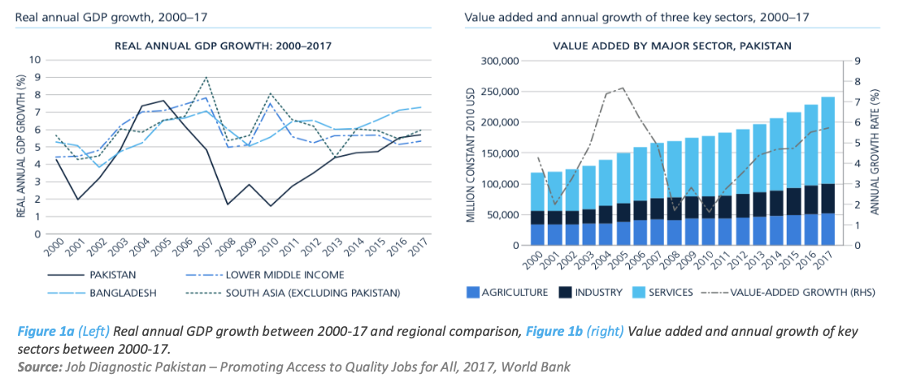

# Pakistan: A Labor Market Analysis
## Best Practice Trends in Facilitating Remittance Flows during COVID-19

### Executive Summary

Key Economic, Poverty and Labor Market Trends
Pakistan’s growth is affected by repeated periods of economic volatility. Between 2000 and
2017, Pakistan underwent cycles of economic volatilities. In particular, the period of boom, between 2000
and 2005, bust between 2006 and 2011, and recovery between 2012 and 2017 (Figure 1a).

<!--  -->

imports, external loans, and foreign assistance.

### Demographic Overview

Pakistan is undergoing significant demographic transition, characterized by:
- Population growth rate of 2.3%
- Youth bulge with 64% under age 30
- Gradual urbanization trends
- Notable gender disparities in economic participation

### Key Economic Indicators

| Indicator | Value | Year |
|-----------|-------|------|
| GDP per capita | $1,410 | 2019 |
| GDP Growth | -0.4% | 2020 |
| Inflation Rate | 10.7% | 2020 |
| Unemployment | 4.5% | 2020 |

### Labor Market Structure

1. **Sectoral Distribution**
   - Agriculture: 39%
   - Industry: 24%
   - Services: 37%

2. **Key Challenges**
   - High informal sector employment
   - Low female labor force participation
   - Skills mismatch in labor market
   - Limited job creation in formal sector

### Policy Recommendations

1. **Short-term Measures**
   - Expand social safety nets
   - Support SME development
   - Enhance labor market information systems

2. **Long-term Strategies**
   - Invest in human capital development
   - Promote formal sector employment
   - Strengthen vocational training programs
   - Improve labor market regulations

### Future Outlook

The analysis suggests several key trends that will shape Pakistan's labor market:
- Growing youth workforce
- Increasing urbanization
- Digital transformation
- Regional economic integration

### Methodology

This study employs a mixed-methods approach combining:
- Quantitative analysis of labor market data
- Qualitative interviews with stakeholders
- Case studies of successful interventions
- Comparative analysis with regional peers

### References

1. Pakistan Bureau of Statistics (2020)
2. World Bank Development Indicators
3. International Labour Organization
4. State Bank of Pakistan Annual Reports